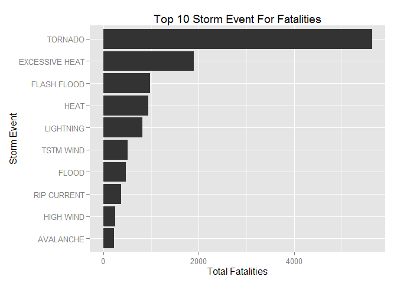
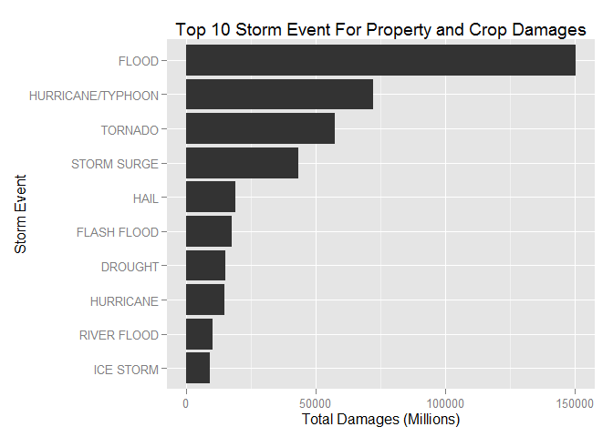

# Storm Data Analysis

Lau Heng Kar

November 21, 2015 (Reproducible Research: Peer Assessment 2)

# Synopsis

The basic goal of this analysis is to explore the U.S. National Oceanic and Atmospheric Administration's (NOAA) Storm Database and answer some basic questions about severe weather events. This analysis answers the two questions:

1. Across the United States, which types of events (as indicated in the EVTYPE variable) are most harmful with respect to population health?

2. Across the United States, which types of events have the greatest economic consequences?

In particluar, this document explains how the data was loaded, cleaned, and analyzed for its impact on population health and economic damage.

# Data Processing

The NOAA storm database are stored in a file beginning from year 1995 until 2011. The file is downloaded from a mirror location stated in the `fileurl` and the processing will stop if download was not initiated. The data come in the form of a comma-separated-value file compressed via the bzip2 algorithm to reduce its size. 

#### Library Required

```r
require(R.utils)
require(dplyr)
require(ggplot2)
```

#### Loading Data

```r
# Loading and preprocessing the data
fileurl <- "https://d396qusza40orc.cloudfront.net/repdata%2Fdata%2FStormData.csv.bz2"
filename <- "repdata-data-StormData.csv"
filenamezip <- "repdata-data-StormData.csv.bz2"

if(!file.exists(filename)) {
    # Downloading data
    if(!file.exists(filenamezip)) {
        download.file(fileurl, filenamezip, mode="wb")        
    }
    bunzip2(filenamezip, filename, remove = FALSE, skip = TRUE)
}

# Read cached data exists then reuse
if(!exists("cacheddata")){
    cacheddata <- read.table("repdata-data-StormData.csv", sep = ",", header = T)
}
```

#### Cleaning Data

Visual inspection of the data shows that there are problems that must be rectified with data cleaning. First, there are a number of records that could be removed to reduce the records size. Next, number of variable could be reduced. An example of these are:


```r
# Selected value > 0 and related column
cacheddata <- filter(cacheddata, INJURIES > 0 | FATALITIES > 0 | PROPDMG > 0 | CROPDMG > 0)
cacheddata <- select(cacheddata, c(EVTYPE, INJURIES, FATALITIES, PROPDMG, PROPDMGEXP, CROPDMG, CROPDMGEXP))

summary(cacheddata)
```

```
##                EVTYPE         INJURIES           FATALITIES      
##  TSTM WIND        :63234   Min.   :   0.0000   Min.   :  0.0000  
##  THUNDERSTORM WIND:43655   1st Qu.:   0.0000   1st Qu.:  0.0000  
##  TORNADO          :39944   Median :   0.0000   Median :  0.0000  
##  HAIL             :26130   Mean   :   0.5519   Mean   :  0.0595  
##  FLASH FLOOD      :20967   3rd Qu.:   0.0000   3rd Qu.:  0.0000  
##  LIGHTNING        :13293   Max.   :1700.0000   Max.   :583.0000  
##  (Other)          :47410                                         
##     PROPDMG          PROPDMGEXP        CROPDMG          CROPDMGEXP    
##  Min.   :   0.00   K      :231428   Min.   :  0.000          :152664  
##  1st Qu.:   2.00          : 11585   1st Qu.:  0.000   K      : 99932  
##  Median :   5.00   M      : 11320   Median :  0.000   M      :  1985  
##  Mean   :  42.75   0      :   210   Mean   :  5.411   k      :    21  
##  3rd Qu.:  25.00   B      :    40   3rd Qu.:  0.000   0      :    17  
##  Max.   :5000.00   5      :    18   Max.   :990.000   B      :     7  
##                    (Other):    32                     (Other):     7
```

# Population Health Impact

Population health impact is determined from the sum number of injuries and fatalities from weather events that have consequences to people (i.e. Fatalities or Injuries > 0). The top 10 damaging events are then extracted and plotted.

#### Compute Fatalities


```r
library(ggplot2)
FatalitiesSum <- aggregate(cacheddata$FATALITIES, by=list(cacheddata$EVTYPE), FUN=sum, na.rm=T)
colnames(FatalitiesSum) <- c("event", "fatalities")
FatalitiesDesc <- FatalitiesSum[order(-FatalitiesSum$fatalities), ]
FatalitiesTop10 <- head(FatalitiesDesc, 10)
FatalitiesTop10$event <- reorder(FatalitiesTop10$event, FatalitiesTop10$fatalities)
qplot(x = FatalitiesTop10$event, 
      y = FatalitiesTop10$fatalities,
      data = FatalitiesTop10,
      geom = "bar",
      stat="identity",
      main = 'Top 10 Storm Event For Fatalities',
      xlab = "Storm Event", 
      ylab = "Total Fatalities") + coord_flip()
```

 

#### Compute Injuries


```r
InjuriesSum <- aggregate(cacheddata$INJURIES, by=list(cacheddata$EVTYPE), FUN=sum, na.rm=T)
colnames(InjuriesSum) <- c("event", "injuries")
InjuriesDesc <- InjuriesSum[order(-InjuriesSum$injuries), ]
InjuriesTop10 <- head(InjuriesDesc, 10)
InjuriesTop10$event <- reorder(InjuriesTop10$event, InjuriesTop10$injuries)
qplot(x = InjuriesTop10$event, 
      y = InjuriesTop10$injuries,
      data = InjuriesTop10,
      geom = "bar",
      stat="identity",
      main = 'Top 10 Storm Event For Injuries',
      xlab = "Storm Event", 
      ylab = "Total Injuries") + coord_flip()
```

 


# Economic Consequences

To analyize the economic damage from weather events, the dollar figure is first calculated and stored in a separate column named, DMG.TOTAL

The estimated damage also have a multiplier column named *PROPDMGEXP* and *CROPDMGEXP*, the values are normalized with the multiplier to yield the exact amount. 

The bar plot of econmic damage shows values in millions of dollars from the top 10 most damaging weather events. 

#### Compute Damages


```r
convertTotal <- function (damage, precision) {
    if (precision %in% c("H", "h"))
        multiplier <- 2
    else if (precision %in% c("K", "k"))
        multiplier <- 3
    else if (precision %in% c("M", "m"))
        multiplier <- 6
    else if (precision %in% c("B", "b"))
        multiplier <- 9
    else
        multiplier <- 0
    
    return (damage * 10 ^ multiplier)
}
```


```r
require(dplyr)
# Add Total variable
cacheddata <- mutate(cacheddata, PROPDMG.TOTAL = mapply(convertTotal, PROPDMG, PROPDMGEXP))
cacheddata <- mutate(cacheddata, CROPDMG.TOTAL = mapply(convertTotal, CROPDMG, CROPDMGEXP))
cacheddata <- mutate(cacheddata, DMG.TOTAL = mapply(sum, PROPDMG.TOTAL, CROPDMG.TOTAL))

# compute damages
DamageSum <- aggregate(cacheddata$DMG.TOTAL, by=list(cacheddata$EVTYPE), FUN=sum, na.rm=T)
colnames(DamageSum) <- c("event", "damages")
DamageSum <- DamageSum[order(-DamageSum$damages), ]
DamageTop10 <- head(DamageSum, 10)
DamageTop10$event <- reorder(DamageTop10$event, DamageTop10$damages)

qplot(x = DamageTop10$event, 
      y = DamageTop10$damages/1000000,
      data = DamageTop10,
      geom = "bar",
      stat="identity",
      main = 'Top 10 Storm Event For Property and Crop Damages',
      xlab = "Storm Event", 
      ylab = "Total Damages (Millions)") + coord_flip()
```

 


# Results
The below concluded numbers are the sum from the events since 1995 to 2011

1. Storm event **TORNADO** is the top cause of fatalities, taking 5633 lifes.
2. Injuries to population are mainly cause by **TORNADO** which injured 9.1346\times 10^{4}
3. Total damages from property and crop damages amount to 150.3196783 billions which is cause by **FLOOD**


